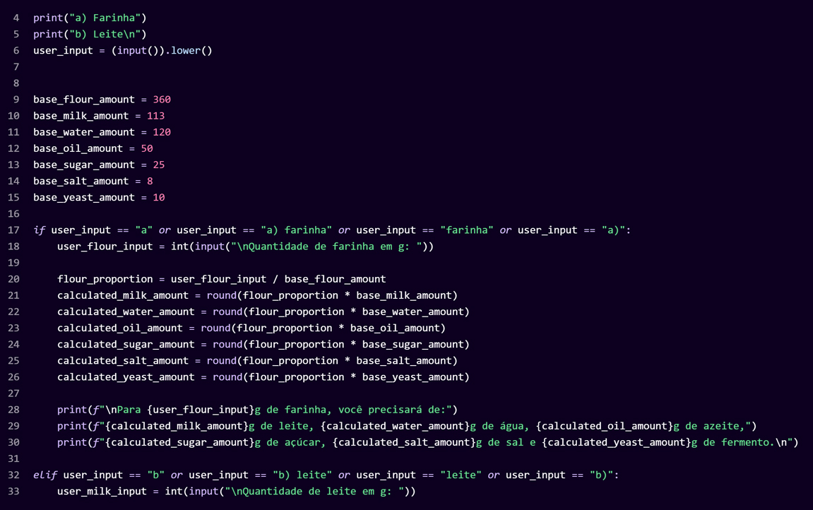
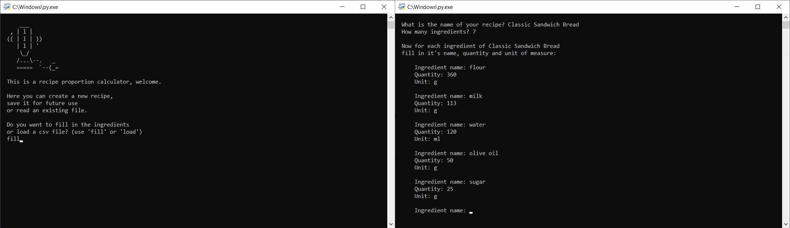
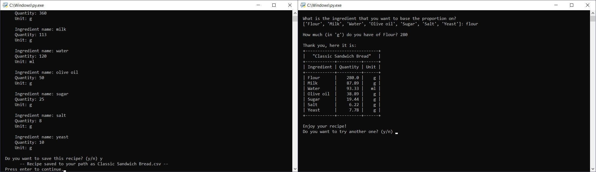
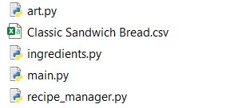
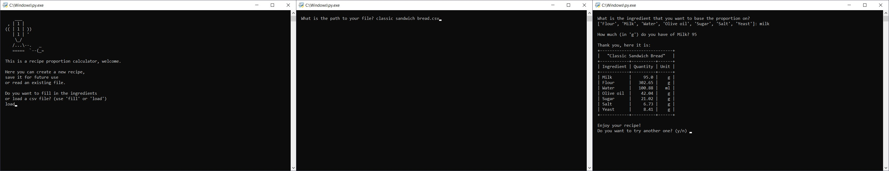

# Recipe Proportion Calculator
Hi! This is a python calculator that helps you scale a recipe for a specific ingredient quantity. 
After filing the recipe data, you can also export it in a .csv file that can be read in the application, excluding the need to manually input a frequently used one.

## Live Demo
You can access it through [it's replit](https://replit.com/@leticia0/Recipe-Proportion-Calculator?embed=1#main.py), just click on "Run" and keep in mind that it can take a few seconds to start.

## About
This calculator originated from my [first](https://replit.com/@leticia0/Calculadora-Farinha-mobile?embed=1#main.py) personal python project (see the snippet below), 
made for this specific (and great!!) [recipe](https://www.kingarthurbaking.com/recipes/classic-sandwich-bread-recipe) and inspired by a day of late june/22 
when the amount of flour available at home wasn't enough for the full loaf.

  

It was made with the knowledge that I had at the time (as you can see, I didn't even know how to use loops) 
and it worked for what it was supposed to, but definitely had room for improvements.

My idea with this new Recipe Proportion Calculator was to use some features that I learned up until now to add some functionalities and also to practice with some data handling tools, even if it was on a smaller scale. I used some __Oriented Object Programming__ concepts to have both the ingredients and the recipes as specific classes, used the __Pandas__ package to handle the files and the __PrettyTable__ library to display the final result.

## What you need to run it
If you'd like to run it from your computer you need to have these installed:
- [Python 3](https://www.python.org/downloads/)
- [Pandas](https://pypi.org/project/pandas/)
  `python -m pip install pandas`
- [PrettyTable](https://pypi.org/project/prettytable/)
  `python -m pip install -U prettytable`
  
 After that, just download and unzip the files where chosen and you can run the main.py through the python interpreter! 
 (If it doesn't happen automatically just right click on it and choose `Open With -> Python`)
 
 ## Usage
 With the interpreter running, just fill the inputs as you want. As an example, I'll use the same bread recipe to illustrate:
 
 First, you have to option to start from scratch (fill) or use an existing file (load). 
 I'll fill in the recipe and save it:
 
 
 
 
 Now, looking at the folder we can see a new file was created,
 
 
 
 and it can later be used to skip manually filing the values all over again:
 
 
 
 ## Conclusion
 It's still a very simple application without even a graphic interface, but it was fun to compare with where I was two months ago!
 
 If you have any comments or sugestions feel free to reach me at leticiaborba.b@gmail.com
